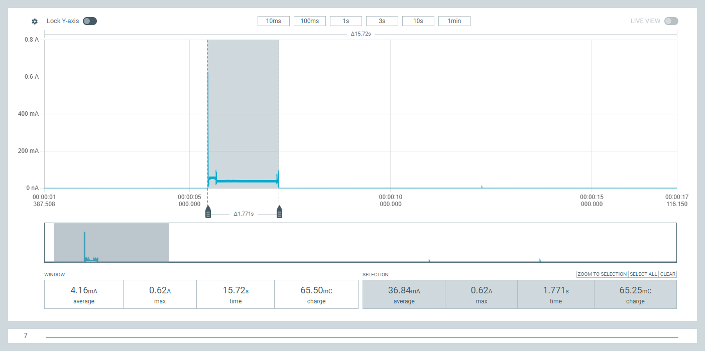
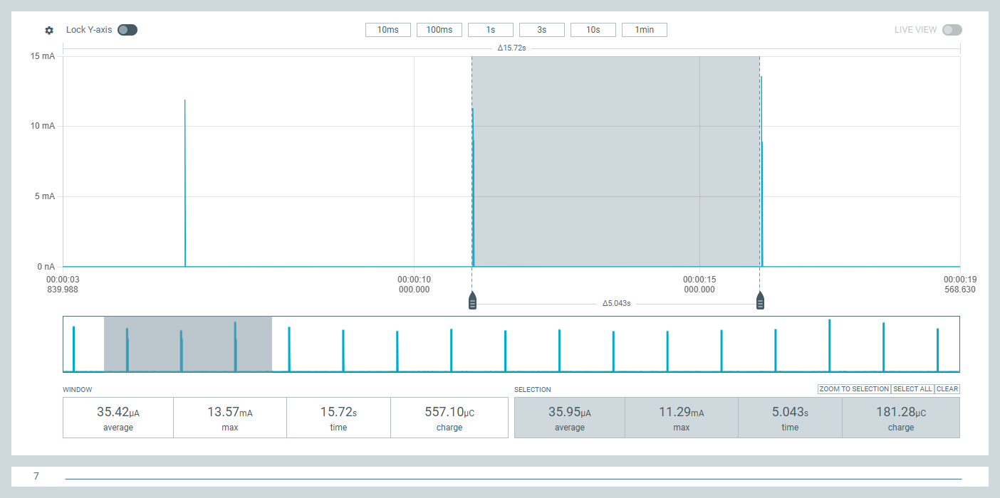
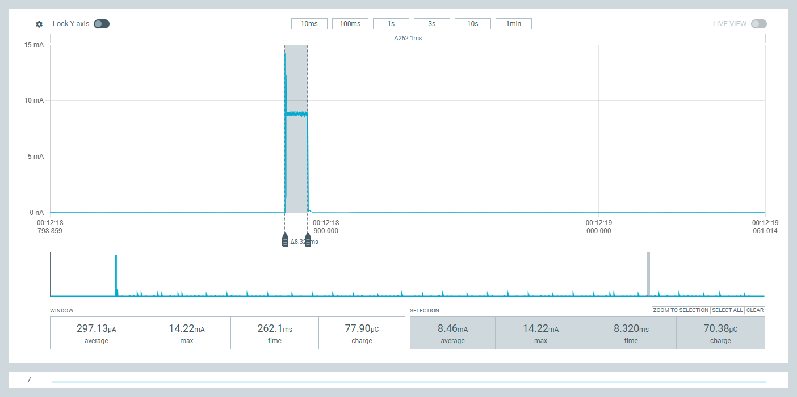
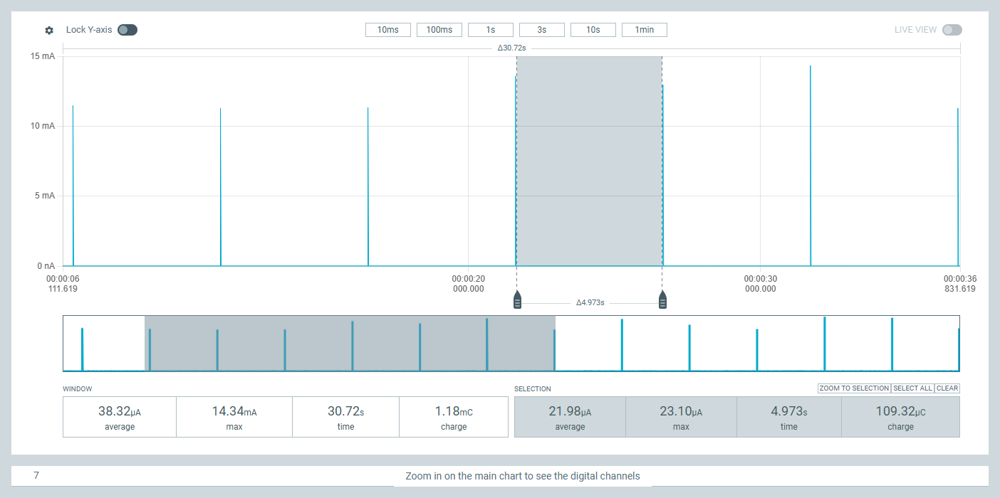
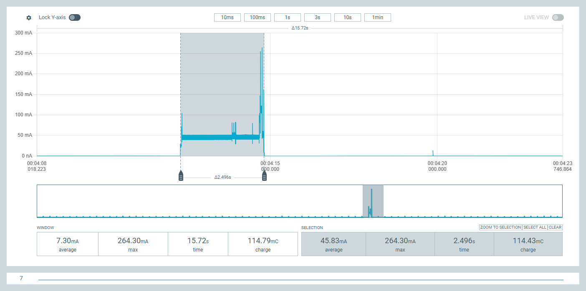

# NPPK2 RxDutyCycle Observations — HVAC System Monitor (Outside Node)

Nordic PPK2 current captures of the outside node's register-level `SetRxDutyCycle` WOR cycle, including power-on init and a full WOR wake/transmit period.

## Power-On / EoRa Pi Init



Capture from power application through radio/module initialization.

| Metric | Window (15.72 s) | Selection (1.771 s) |
|---|---|---|
| Average | 4.16 mA | 36.84 mA |
| Max | 0.62 A | 0.62 A |
| Charge | 65.50 mC | 65.25 mC |

## One Complete RxDutyCycle



Full active + sleep window for a single `SetRxDutyCycle` cycle.

| Metric | Window (15.72 s) | Selection (5.043 s) |
|---|---|---|
| Average | 35.42 µA | 35.95 µA |
| Max | 13.57 mA | 11.29 mA |
| Charge | 557.10 µC | 181.28 µC |

## Active (Rx) Segment



Zoomed view of the receive-active portion of the cycle.

| Metric | Window (262.1 ms) | Selection (8.320 ms) |
|---|---|---|
| Average | 297.13 µA | 8.46 mA |
| Max | 14.22 mA | 14.22 mA |
| Charge | 77.90 µC | 70.38 µC |

## Sleep Segment



Zoomed view of the sleep portion between active windows.

| Metric | Window (30.72 s) | Selection (4.973 s) |
|---|---|---|
| Average | 38.32 µA | 21.98 µA |
| Max | 14.34 mA | 23.10 µA |
| Charge | 1.18 mC | 109.32 µC |

## WOR / ESP32-S3 Wake Period



Full wake event: EXT0 wakeup through BME280 read, ESP-NOW transmit, and re-arm into deep sleep.

| Metric | Window (15.72 s) | Selection (2.496 s) |
|---|---|---|
| Average | 7.30 mA | 45.83 mA |
| Max | 264.30 mA | 264.30 mA |
| Charge | 114.79 mC | 114.43 mC |

## Battery Life Estimate — MakerFocus 3000 mAh LiPo

Method: nameplate capacity ÷ average current, converted to months (÷ 24 h/day ÷ 30.44 days/month). No derating applied for self-discharge, regulator quiescent draw, or end-of-life voltage cutoff — treat as theoretical/upper-bound.

**Duty-cycle-only (no wake events), using this session's captures:**

| Source | Avg Current | Battery Life |
|---|---|---|
| One complete RxDutyCycle (window, sleep+active blended) | 35.42 µA | ~9.7 years (~116 months) |
| Isolated sleep-only floor (Sleep Segment *selection*, no active spike) | 21.98 µA | ~15.6 years (~187 months) |

Note: the Sleep Segment *window* (30.72 s, 38.32 µA avg, 14.34 mA max) isn't a clean sleep-only reading — its max shows it still contains active-pulse spikes, so it's really another blended full-cycle average and shouldn't be read as distinct from the row above. The 21.98 µA selection, with no spike in its max, is the actual isolated floor.

**With 20 WOR wake events/day (confirmed):** each wake (EXT0 → BME280 read → ESP-NOW TX → re-arm) costs ~114.4 mC (~0.0318 mAh), per the WOR wake-period capture above.

- Daily wake charge: 20 × 0.0318 mAh = 0.636 mAh/day
- Added average current: 0.636 mAh ÷ 24 h ≈ 26.5 µA
- Blended average: 35.42 µA (baseline duty cycle) + 26.5 µA (wake events) ≈ **61.9 µA**

| Figure | Value |
|---|---|
| Blended average current | ~61.9 µA |
| Battery life | ~2,020 days → **~66 months (~5.5 years)** |

This is the headline real-world figure for the repo — duty-cycle listening and the 20/day wake events contribute roughly equal shares to total drain.


## LoRa Config
```
  // Arguments: freq, bw, sf, cr, syncWord, power, preambleLength, tcxoVoltage, useRegulatorLDO
  int state = radio.begin(
    915.0,                              // Frequency: 915.0 MHz
    125.0,                              // Bandwidth: 125 kHz
    7,                                  // SF7
    5,                                  // CR 4/5 (Set to 5, NOT 7)
    RADIOLIB_SX126X_SYNC_WORD_PRIVATE,  // Resolves to 0x1424
    -1,                                 // Tx Power: 2 dBm
    5200,                               // WOR Preamble: 5000 symbols (~5.12s)
    0.0,                                // 0.0V = Crystal (XTAL), NOT TCXO!
    true                                // true = Use LDO Regulator Mode
  );
  
 ## ESP-Now BME280 Node, rxDutyCycle ticks
 
 #define RXDC_RX_TICKS       512UL     
 #define RXDC_SLEEP_TICKS 	323648UL    

  

